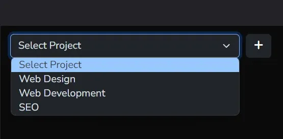
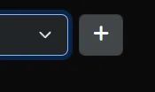
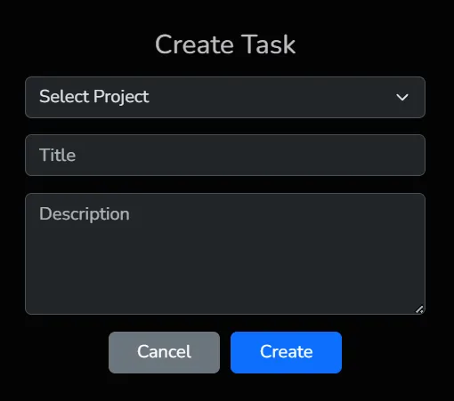

# Task Manager

**Note:** Please view this readme in [github](https://github.com/jerome-shiftleft/coalition-technologies) so you can view the embedded images

## Installation

- Download/clone this [repository](https://github.com/jerome-shiftleft/coalition-technologies)
- Copy .env.example **`cp .env.example .env`**
- Update `.env` file. Change `APP_URL` to match your virtual host url. 
This is **required** if you want to use **browsersync**
- `composer install`
- `php artisan key:generate`
- `npm install`
- `npm run dev`

### Setup Database
- Create a database.
- Update `.env` file to match your database.
- Run `php artisan migrate --seed` to generate dummy data for the database.
- Run `php artisan migrate:fresh --seed` or `source seed.sh` if you want to regenerate new dummy data.
- The generated dummy data are random latin words. If you want english dummy data that makes sense, you can **import database/dump/test.sql**

## Task Manager Usage

### Select Project

### Create Task
Click the plus button and the create task modal will popup.

## Compiling Assets (Laravel Mix)

**`npm run dev`** compiles assets for development. Generates source maps for better debugging.  
**`npm run watch`** compiles assets for development, just like **`npm run dev`** but watches files for changes. 
If you modify any source file, it will automatically recompile the affected assets. 
Useful during development to automatically compile assets as you work without needing to run the build command repeatedly. 
If **`BROWSER_SYNC=true`** in .env, it will automatically reloads the browser after compiling.  
**`npm run prod`** compiles assets for production. Minifies the code to reduce file size.

**NOTE**: The following files are included in .gitignore to prevent merge conflicts when compiling assets and deploying. 
**If you fetch updates, ensure you recompile the assets on your machine or server**.

- public/mix-manifest.json
- public/css/app.css
- public/css/app-sass.css
- public/js/app.js
- public/js/vendor.js
- public/js/manifest.js
- public/js/app.js.LICENSE.txt
- public/js/vendor.js.LICENSE.txt

## Additional Packages Installed

### Composer Packages
- [Laravel Livewire](https://laravel-livewire.com)

### NPM Packages

#### devDependencies
- [imagemin](https://www.npmjs.com/package/imagemin)
- [imagemin-webp](https://www.npmjs.com/package/imagemin-webp) - used by **`npm run webp`**

### dependencies
- [bootstrap](https://www.npmjs.com/package/bootstrap)
- [popperjs](https://www.npmjs.com/package/@popperjs/core)
- [jquery](https://www.npmjs.com/package/jquery)
- [jquery-ui](https://www.npmjs.com/package/jquery-ui)
- [alpinejs](https://www.npmjs.com/package/alpinejs)
- [livewire-sortable](https://www.npmjs.com/package/livewire-sortable)
- [fontawesome](https://www.npmjs.com/package/@fortawesome/fontawesome-free)
- [moment](https://www.npmjs.com/package/moment)
- [select2](https://www.npmjs.com/package/select2)

## License

The Laravel framework is open-sourced software licensed under the [MIT license](https://opensource.org/licenses/MIT).
